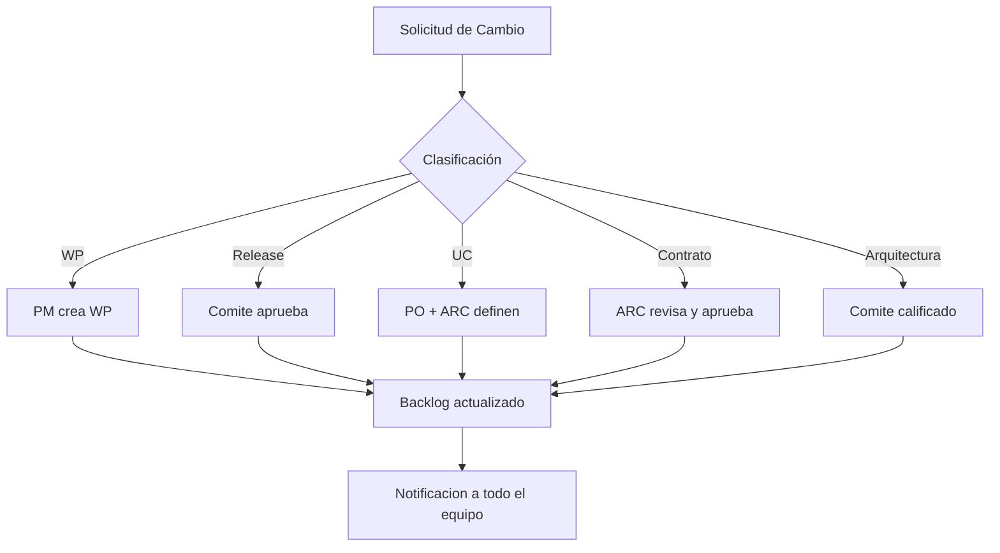

> **Versión:** 1.0.0  
> **Clasificación:** Arquitectura de Gobierno  
> **Dependencias:**  
> - HERMES_ENTERPRISE_REFERENCE_ARCHITECTURE.md (RC15.1)  
> - HERMES_ENTERPRISE_USE_CASE_CATALOG.md (RC15.2)  
> - ENTERPRISE_EXECUTION_MODEL.md (RC15.3)  
> - HERMES_ENTERPRISE_QUALITY_GATE.md (RC15.4)  
> - HERMES_ENTERPRISE_ENGINEERING_STANDARD.md (RC15.5)  
> - IMPLEMENTATION_BACKLOG.md  
> - KERNEL_CONTRACT_SPECIFICATION.md  
> **Propósito:** Definir el marco de gobierno que controla cómo se priorizan, asignan, ejecutan, aprueban, bloquean, reprograman y cierran los Work Packages de implementación en HERMES Enterprise.

---

## Índice

1. [Modelo de Gobierno](#1-modelo-de-gobierno)
2. [Roles](#2-roles)
3. [Estados de un Work Package](#3-estados-de-un-work-package)
4. [Máquina de Estados](#4-máquina-de-estados)
5. [Comité de Decisiones](#5-comité-de-decisiones)
6. [Gestión de Riesgos](#6-gestión-de-riesgos)
7. [Control de Cambios](#7-control-de-cambios)
8. [Matriz RACI](#8-matriz-raci)
9. [Release Management](#9-release-management)
10. [Métricas](#10-métricas)
11. [Dashboard Ejecutivo](#11-dashboard-ejecutivo)
12. [Implementation Playbook](#12-implementation-playbook)
13. [IA Governance](#13-ia-governance)
14. [Criterios de Aceptación](#14-criterios-de-aceptación)

---

## 1. Modelo de Gobierno

El gobierno de implementación sigue una cadena de 7 niveles que garantiza trazabilidad completa desde la visión arquitectónica hasta la liberación en producción.

### 1.1 Cadena de Gobierno

```
Nivel 1: Arquitectura de Referencia
    ↓ Define límites y principios
Nivel 2: Caso de Uso (UC)
    ↓ Define qué necesita el negocio
Nivel 3: Roadmap del Producto
    ↓ Define cuándo se entrega
Nivel 4: Release (RC)
    ↓ Agrupa entregables por versión
Nivel 5: Work Package (WP)
    ↓ Unidad atómica de implementación
Nivel 6: Quality Gates (QG)
    ↓ Validan que cumple los criterios
Nivel 7: Aprobación de Liberación
    ↓ Decisión final: pasa a producción
```

### 1.2 Principios del Gobierno

| # | Principio | Descripción |
|---|-----------|-------------|
| P1 | **Trazabilidad Total** | Cada WP debe poder rastrearse hasta un UC, y cada UC hasta la Arquitectura |
| P2 | **Separación de Deberes** | Quien implementa no puede aprobar; quien revisa no puede implementar |
| P3 | **Calidad como Gate** | Ningún WP pasa a producción sin superar los 10 Quality Gates |
| P4 | **Riesgo Explícito** | Todo WP debe tener un registro de riesgo actualizado antes de comenzar |
| P5 | **Transparencia Total** | El estado de cada WP es público en el Dashboard Ejecutivo |
| P6 | **Mejora Continua** | Las métricas del Sprint Retro alimentan el siguiente ciclo de gobierno |
| P7 | **Automatización Progresiva** | Toda decisión repetitiva debe ser automatizada en el Pipeline |

### 1.3 Artefactos del Gobierno

| Artefacto | Responsable | Frecuencia |
|-----------|-------------|------------|
| Backlog Prioritizado | PO + PM | Semanal |
| Plan de Release | PM + Arquitecto | Por Release |
| Estado de WP | Desarrollador / Agente IA | Diario |
| Reporte de Riesgos | PM | Semanal |
| Dashboards Ejecutivos | Automatizado | Tiempo real |
| Acta de Comité | Secretario del Comité | Por sesión |
| Release Notes | PM | Por Release |

---

## 2. Roles

### 2.1 Definición de Roles

| # | Rol | Código | Descripción |
|---|-----|--------|-------------|
| 1 | **Arquitecto** | `ARC` | Define la arquitectura, supervisa el cumplimiento técnico y los contratos |
| 2 | **Product Owner** | `PO` | Prioriza el backlog, define valor de negocio y acepta funcionalmente |
| 3 | **Project Manager** | `PM` | Gestiona el plan, recursos, riesgos y coordina el equipo |
| 4 | **Desarrollador** | `DEV` | Implementa Work Packages siguiendo el estándar |
| 5 | **Agente IA** | `AIA` | Agente autónomo que ejecuta WPs bajo supervisión humana |
| 6 | **Revisor Técnico** | `REV` | Realiza code review, verifica calidad técnica |
| 7 | **Quality Manager** | `QM` | Define y supervisa Quality Gates, audita calidad |
| 8 | **Release Manager** | `RM` | Gestiona el proceso de release, versionado y despliegue |
| 9 | **Azure Administrator** | `AZR` | Administra recursos Azure, despliegues, políticas de cloud |
| 10 | **GitHub Administrator** | `GIT` | Administra repositorios, branches, protecciones, Actions |

### 2.2 Responsabilidades por Rol

#### 2.2.1 Arquitecto (ARC)
- Definir y mantener la Arquitectura de Referencia
- Aprobar cambios en contratos de interfaces
- Validar que las implementaciones cumplan los principios arquitectónicos
- Participar en el Comité de Decisiones
- Revisar propuestas de nuevos UCs con impacto arquitectónico

#### 2.2.2 Product Owner (PO)
- Definir y priorizar el backlog del producto
- Redactar y mantener los Casos de Uso (UCs)
- Aceptar funcionalmente los WPs completados
- Validar que el valor de negocio se entregue según lo planeado
- Participar en el Comité de Decisiones

#### 2.2.3 Project Manager (PM)
- Crear y mantener el plan de implementación
- Gestionar el registro de riesgos
- Asignar WPs a desarrolladores/agentes IA
- Reportar estado semanal al Comité
- Coordinar releases y generar Release Notes

#### 2.2.4 Desarrollador (DEV)
- Implementar WPs según el estándar de ingeniería
- Ejecutar pruebas unitarias y de integración
- Documentar el código y la implementación
- Actualizar el estado del WP en el sistema
- Participar en code reviews como revisor o autor

#### 2.2.5 Agente IA (AIA)
- Ejecutar WPs asignados siguiendo las reglas de CLINE.md
- Reportar estado, bloqueos y riesgos automáticamente
- No aprobar ni rechazar sus propios WPs (separación de deberes)
- Generar documentación técnica de las implementaciones
- Solicitar revisión humana cuando se requiera

#### 2.2.6 Revisor Técnico (REV)
- Realizar code review de todos los WPs antes de Quality Gate
- Verificar cumplimiento del estándar de ingeniería
- Identificar deuda técnica y proponer mejoras
- Aprobar o rechazar técnicamente un WP

#### 2.2.7 Quality Manager (QM)
- Definir criterios de aceptación para cada Quality Gate
- Ejecutar auditorías de calidad sobre WPs completados
- Mantener el dashboard de métricas de calidad
- Reportar violaciones de calidad al Comité

#### 2.2.8 Release Manager (RM)
- Gestionar el versionado semántico del producto
- Coordinar Release Candidates y releases finales
- Ejecutar el proceso de hotfix cuando sea necesario
- Mantener el registro de releases y changelogs

#### 2.2.9 Azure Administrator (AZR)
- Aprovisionar y configurar recursos Azure
- Gestionar políticas de seguridad y costos en Azure
- Automatizar despliegues con Azure DevOps / Bicep / ARM
- Monitorear la salud de los servicios en producción

#### 2.2.10 GitHub Administrator (GIT)
- Configurar protección de branches y reglas de push
- Gestionar secrets y variables de entorno en GitHub
- Mantener los Actions runners y pipelines CI/CD
- Auditar accesos y permisos del repositorio

### 2.3 Matriz de Responsabilidades por Artefacto

| Artefacto | Creador | Revisor | Aprobador |
|-----------|---------|---------|-----------|
| Work Package | DEV/AIA | REV | PO |
| Pull Request | DEV/AIA | REV | ARC |
| Release Candidate | RM | QM | PO |
| Release Definitiva | RM | PM | Comité |
| Registro de Riesgos | PM | ARC | PO |
| Documentación Técnica | DEV/AIA | ARC | PM |
| Plan de Release | PM | PO | Comité |

---

## 3. Estados de un Work Package

### 3.1 Diagrama de Estados

```
                  ┌─────────────┐
                  │   DRAFT     │
                  └──────┬──────┘
                         │
                  ┌──────▼──────┐
                  │   PLANNED   │
                  └──────┬──────┘
                         │
                  ┌──────▼──────┐
                  │    READY    │
                  └──────┬──────┘
                         │
                  ┌──────▼───────┐
         ┌────────│ IN PROGRESS  │────────┐
         │        └──────┬───────┘        │
         │               │                │
         │        ┌──────▼───────┐        │
         │        │   BLOCKED    │        │
         │        └──────┬───────┘        │
         │               │                │
         │        ┌──────▼───────┐        │
         │        │   REVIEW     │        │
         │        └──────┬───────┘        │
         │               │                │
         │        ┌──────▼───────┐        │
         │        │   TESTING    │        │
         │        └──────┬───────┘        │
         │               │                │
         │        ┌──────▼────────┐       │
         │        │ QUALITY GATE  │       │
         │        └──────┬────────┘       │
         │               │                │
         │        ┌──────▼────────┐       │
         │        │   APPROVED    │       │
         │        └──────┬────────┘       │
         │               │                │
         │        ┌──────▼────────┐       │
         └────────│   RELEASED    │───────┘
                  └──────┬────────┘
                         │
                  ┌──────▼────────┐
                  │   ARCHIVED    │
                  └───────────────┘

    Estados de Excepción:
    ┌───────────┐     ┌───────────────┐
    │  REJECTED │     │ ROLLED BACK   │
    └───────────┘     └───────────────┘
```

### 3.2 Tabla de Estados

| # | Estado | Código | Descripción | Puede Iniciar |
|---|--------|--------|-------------|---------------|
| 1 | **Draft** | `D` | WP creado, sin detalle completo | No |
| 2 | **Planned** | `P` | WP planificado con estimación y riesgos | No |
| 3 | **Ready** | `R` | WP listo para comenzar implementación | Sí |
| 4 | **In Progress** | `IP` | WP siendo implementado | Sí (reanudar) |
| 5 | **Blocked** | `B` | WP bloqueado por dependencia o impedimento | No |
| 6 | **Review** | `RV` | WP en code review | No |
| 7 | **Testing** | `T` | WP en pruebas unitarias/integración | No |
| 8 | **Quality Gate** | `QG` | WP en validación de calidad | No |
| 9 | **Approved** | `A` | WP aprobado para release | No |
| 10 | **Released** | `RL` | WP desplegado en producción | No |
| 11 | **Rejected** | `RJ` | WP rechazado (vuelve a Ready o Planned) | Sí (replanificado) |
| 12 | **Rolled Back** | `RB` | WP revertido desde producción | Sí (reimplementado) |
| 13 | **Archived** | `AR` | WP cerrado y archivado definitivamente | No |

### 3.3 Reglas de Transición

| Transición | De | A | Evento | Autorizador |
|------------|----|----|--------|-------------|
| Planificar | Draft | Planned | Definción completa | PM |
| Preparar | Planned | Ready | Priorización asignada | PO |
| Iniciar | Ready | In Progress | Asignación a DEV/AIA | PM |
| Bloquear | In Progress | Blocked | Impedimento reportado | DEV/AIA |
| Desbloquear | Blocked | In Progress | Impedimento resuelto | PM |
| Enviar a Review | In Progress | Review | Implementación completa | DEV/AIA |
| Aprobar Review | Review | Testing | Code review OK | REV |
| Rechazar Review | Review | In Progress | Cambios solicitados | REV |
| Completar Testing | Testing | Quality Gate | Pruebas OK | DEV |
| Fallar Testing | Testing | In Progress | Pruebas fallidas | DEV |
| Superar QG | Quality Gate | Approved | Todos los QGs OK | QM |
| Fallar QG | Quality Gate | In Progress | QG no superado | QM |
| Liberar | Approved | Released | Release ejecutado | RM |
| Rechazar | Cualquiera | Rejected | Decisión del Comité | Comité |
| Revertir | Released | Rolled Back | Issue en producción | RM |
| Archivar | Released | Archived | Release estable | PM |
| Replanificar | Rejected | Planned | Nueva planificación | PM |

---

## 4. Máquina de Estados

### 4.1 Definición Formal

La máquina de estados se define como una tupla `(S, E, T, s0, SA)` donde:

- `S` = conjunto de 13 estados `{D, P, R, IP, B, RV, T, QG, A, RL, RJ, RB, AR}`
- `E` = conjunto de eventos de transición
- `T` = función de transición `S × E → S`
- `s0` = estado inicial `D` (Draft)
- `SA` = estados de aceptación `{AR, RL}`

### 4.2 Matriz de Transiciones Completas

| Estado Actual | Evento Válido | Estado Siguiente | Condición |
|---------------|---------------|------------------|-----------|
| Draft (D) | `planificar` | Planned (P) | UC, riesgos, esfuerzo definidos |
| Planned (P) | `preparar` | Ready (R) | Priorizado por PO en el sprint |
| Ready (R) | `iniciar` | In Progress (IP) | Asignado a DEV/AIA |
| In Progress (IP) | `completar` | Review (RV) | Implementación 100% completa, pruebas locales OK |
| In Progress (IP) | `bloquear` | Blocked (B) | Impedimento documentado |
| In Progress (IP) | `rechazar` | Rejected (RJ) | Decisión del Comité |
| Blocked (B) | `desbloquear` | In Progress (IP) | Impedimento resuelto, nueva asignación |
| Blocked (B) | `replanificar` | Planned (P) | Requiere re-planificación |
| Review (RV) | `aprobar_review` | Testing (T) | REV aprueba, todos los comentarios resueltos |
| Review (RV) | `solicitar_cambios` | In Progress (IP) | Cambios solicitados por REV |
| Review (RV) | `rechazar` | Rejected (RJ) | Decisión del Comité |
| Testing (T) | `testing_ok` | Quality Gate (QG) | Pruebas unitarias + integración OK |
| Testing (T) | `testing_fallo` | In Progress (IP) | Pruebas fallidas, bugs reportados |
| Quality Gate (QG) | `qg_ok` | Approved (A) | 10 QGs superados |
| Quality Gate (QG) | `qg_fallo` | In Progress (IP) | QG no superado, correcciones necesarias |
| Approved (A) | `liberar` | Released (RL) | Release programado ejecutado |
| Approved (A) | `rechazar` | Rejected (RJ) | Decisión del Comité |
| Released (RL) | `revertir` | Rolled Back (RB) | Issue en producción crítico |
| Released (RL) | `archivar` | Archived (AR) | Release consolidado |
| Rolled Back (RB) | `replanificar` | Planned (P) | Re-planificación del fix |
| Rejected (RJ) | `replanificar` | Planned (P) | Nueva planificación |
| Rejected (RJ) | `archivar` | Archived (AR) | WP descartado definitivamente |

### 4.3 Eventos y Autorizadores

| Evento | Autorizador | ¿Requiere Comité? |
|--------|-------------|-------------------|
| `planificar` | PM | No |
| `preparar` | PO | No |
| `iniciar` | PM | No |
| `completar` | DEV/AIA | No |
| `bloquear` | DEV/AIA | No |
| `desbloquear` | PM | No |
| `replanificar` | PM | No |
| `aprobar_review` | REV | No |
| `solicitar_cambios` | REV | No |
| `testing_ok` | DEV | No |
| `testing_fallo` | DEV | No |
| `qg_ok` | QM | No |
| `qg_fallo` | QM | No |
| `liberar` | RM | Sí |
| `revertir` | RM | Sí (post-mortem) |
| `archivar` | PM | No |
| `rechazar` | Comité | Sí |

### 4.4 Transiciones Prohibidas

| Transición | Motivo |
|------------|--------|
| Draft → In Progress | Falta planificación y riesgos |
| Blocked → Approved | No se puede saltar Review, Testing y QG |
| In Progress → Released | No se puede saltar controles de calidad |
| Review → Draft | Regresión incorrecta; debe ir a In Progress |
| Released → Approved | Una vez liberado no se puede deshacer sin rollback |
| Rejected → In Progress | Debe pasar por Planned para re-planificar |
| Draft → Released | Violación total de la cadena de gobierno |

---

## 5. Comité de Decisiones

### 5.1 Composición

| Miembro | Rol en el Comité | Voto | Suplente |
|---------|------------------|-----|----------|
| Arquitecto | Miembro Permanente | 1 voto | Arquitecto Adjunto |
| Product Owner | Presidente | 2 votos (calidad de desempate) | PO Alterno |
| Project Manager | Secretario | 1 voto | PM Alterno |
| Quality Manager | Miembro Permanente | 1 voto | QM Alterno |
| Release Manager | Miembro Permanente | 1 voto | RM Alterno |

### 5.2 Decisiones que Requieren Comité

| Decisión | Tipo | Mayoría | Descripción |
|----------|------|---------|-------------|
| Aprobar Release | Release | Simple (3/5) | Un nuevo release pasa a producción |
| Rechazar WP | Excepción | Simple (3/5) | Un WP es rechazado formalmente |
| Cambio de Arquitectura | Arquitectura | Calificada (4/5 incluido ARC) | Modificación de la arquitectura de referencia |
| Nuevo Dominio (UC Dxx) | Estratégica | Calificada (4/5) | Adición de un nuevo dominio funcional |
| Suspender Release | Emergencia | Simple (3/5) | Detener un release en curso |
| Post-Mortem Rollback | Investigación | Simple (3/5) | Analizar causa raíz de un rollback |
| Exención de Quality Gate | Excepción | Calificada (4/5 incluido QM) | Saltar un QG de forma excepcional |
| Cambio de Roadmap | Estratégica | Calificada (4/5) | Repriorización mayor del roadmap |

### 5.3 Reglas de Funcionamiento

- **Quórum mínimo:** 3 de 5 miembros (incluyendo al Presidente o su suplente)
- **Frecuencia ordinaria:** Semanal (cada viernes)
- **Frecuencia extraordinaria:** Convocatoria del Presidente con 24h de antelación
- **Registro:** El Secretario levanta acta en cada sesión
- **Votación:** Oral o asíncrona (por ticket en GitHub)
- **Vetos:** El Presidente (PO) tiene veto sobre decisiones funcionales; el Arquitecto sobre decisiones técnicas
- **Apelación:** Las decisiones del Comité pueden ser apeladas al Steering Committee (nivel ejecutivo) en 48h

### 5.4 Formato de Acta

```markdown
# Acta de Comité — SC-YYYY-MM-DD

**Fecha:** YYYY-MM-DD  
**Asistentes:** ARC, PO, PM, QM, RM  
**Quórum:** 5/5  
**Presidente:** [Nombre]  
**Secretario:** [Nombre]

## Decisiones

| # | Decisión | Tipo | Votos | Resultado | Acción |
|---|----------|------|-------|-----------|--------|
| 1 | Liberar RC-2026-03 | Release | 4-1 | Aprobado | RM ejecuta release |
| 2 | Rechazar WP-042 | Excepción | 5-0 | Rechazado | PM replanifica |

## Riesgos Revisados

- [R-007] Riesgo de disponibilidad de Azure — Mitigado con redundancia

## Próxima Sesión

YYYY-MM-DD
```

---

## 6. Gestión de Riesgos

### 6.1 Categorías de Riesgo

| # | Categoría | Código | Descripción |
|---|-----------|--------|-------------|
| 1 | **Técnicos** | `RISK-TECH` | Deuda técnica, errores de diseño, performance |
| 2 | **Funcionales** | `RISK-FUNC` | Desviación de requerimientos, UCs incompletos |
| 3 | **Cloud** | `RISK-CLD` | Costos Azure, disponibilidad, capacidad |
| 4 | **IA** | `RISK-IA` | Errores de agente IA, alucinaciones, sesgos |
| 5 | **Azure** | `RISK-AZR` | Configuración de recursos, políticas, seguridad |
| 6 | **GitHub** | `RISK-GH` | Permisos, Actions, secrets, ramas |
| 7 | **Seguridad** | `RISK-SEC` | Vulnerabilidades, compliance, accesos |
| 8 | **Dependencias** | `RISK-DEP` | Paquetes externos, versiones, compatibilidad |
| 9 | **Entorno** | `RISK-ENV` | Configuración local/diferencia con producción |
| 10 | **Release** | `RISK-REL` | Regresión, downtime, rollback, hotfix incompleto |

### 6.2 Matriz Probabilidad × Impacto

| Probabilidad \ Impacto | Bajo (1) | Medio (2) | Alto (3) | Crítico (4) |
|------------------------|----------|-----------|----------|-------------|
| **Alta (4)** | Medio (4) | Alto (6) | Alto (8) | Crítico (10) |
| **Media-Alta (3)** | Bajo (3) | Medio (5) | Alto (7) | Crítico (9) |
| **Media (2)** | Bajo (2) | Medio (4) | Medio (6) | Alto (8) |
| **Baja (1)** | Bajo (1) | Bajo (3) | Medio (5) | Alto (7) |

**Puntuación = Probabilidad × Impacto**

### 6.3 Niveles de Riesgo

| Nivel | Rango | Color | Acción |
|-------|-------|-------|--------|
| **Bajo** | 1-3 | 🟢 | Monitoreo estándar |
| **Medio** | 4-5 | 🟡 | Plan de mitigación requerido |
| **Alto** | 6-8 | 🟠 | Plan de mitigación + reporte al Comité |
| **Crítico** | 9-10 | 🔴 | Escalación inmediata + suspensión del WP |

### 6.4 Escalera de Escalación

```
Nivel 1: DEV/AIA → PM
    ↓ Reporta el riesgo identificado
Nivel 2: PM → Comité de Decisiones
    ↓ Si el riesgo es Alto o requiere decisión
Nivel 3: Comité → Steering Committee
    ↓ Si el riesgo es Crítico o afecta el roadmap
```

### 6.5 Plantilla de Registro de Riesgo

```json
{
  "id": "R-001",
  "wp": "WP-042",
  "fecha": "2026-07-30",
  "categoria": "RISK-TECH",
  "descripcion": "Dependencia de librería X no compatible con PS7",
  "probabilidad": 3,
  "impacto": 3,
  "puntuacion": 9,
  "nivel": "CRÍTICO",
  "plan_mitigacion": "Migrar a librería Y antes de iniciar implementación",
  "responsable": "ARC",
  "estado": "ACTIVO",
  "fecha_resolucion": null
}
```

---

## 7. Control de Cambios

### 7.1 Tipos de Cambio

| Tipo | Código | ¿Qué se necesita? | Autorizador |
|------|--------|-------------------|-------------|
| **Nuevo Work Package** | `CAMBIO-WP` | Nuevo WP en el backlog | PM |
| **Nuevo Release** | `CAMBIO-REL` | Nueva release planificada | Comité |
| **Nuevo Caso de Uso** | `CAMBIO-UC` | Nuevo UC en el catálogo | PO + ARC |
| **Cambio de Contrato** | `CAMBIO-CT` | Modificación de interfaz pública | ARC |
| **Cambio de Arquitectura** | `CAMBIO-ARC` | Modificación de la Reference Architecture | Comité (calificada) |

### 7.2 Proceso de Cambio



### 7.3 Reglas de Cambio

| Regla | Descripción |
|-------|-------------|
| R1 | Todo cambio debe tener un identificador único (`CAMBIO-XXX`) |
| R2 | No se puede cambiar un contrato sin notificar a todos los consumidores |
| R3 | Un cambio de arquitectura requiere actualizar la Reference Architecture |
| R4 | Los cambios en UCs aprobados requieren re-aprobación del PO |
| R5 | Los cambios en releases publicadas requieren Release Notes adicionales |
| R6 | Ningún cambio puede ser realizado directamente en producción sin pasar por el proceso |
| R7 | Los cambios urgentes (hotfix) siguen un proceso express pero deben ser regularizados en 24h |

### 7.4 Proceso Express para Hotfix

1. **Identificación** — RM identifica el bug crítico en producción
2. **Solicitud** — RM solicita hotfix al Comité (aprobación verbal o por chat)
3. **Branch** — Se crea branch `hotfix/xxx` desde `main`
4. **Implementación** — DEV/AIA implementa el fix
5. **Review Express** — REV revisa en máximo 2h
6. **Quality Gate Express** — QM valida solo QGs relevantes (QG-01, QG-04, QG-07)
7. **Release** — RM despliega el hotfix
8. **Regularización** — En 24h se crea un WP de regularización en el backlog

---

## 8. Matriz RACI

### 8.1 Actividades del Gobierno

| # | Actividad / Decisión | ARC | PO | PM | DEV | AIA | REV | QM | RM | AZR | GIT |
|---|---------------------|:--:|:--:|:--:|:--:|:--:|:--:|:--:|:--:|:--:|:--:|
| **Planificación** |
| 1 | Definir UC | A | R | C | I | I | I | I | I | I | I |
| 2 | Priorizar backlog | C | R | A | I | I | I | C | C | I | I |
| 3 | Estimar esfuerzo WP | C | A | R | C | C | I | I | I | I | I |
| 4 | Crear plan de release | C | A | R | I | I | I | C | C | I | I |
| **Ejecución** |
| 5 | Implementar WP | C | I | A | R | R | I | I | I | I | I |
| 6 | Escribir pruebas | I | I | A | R | R | C | I | I | I | I |
| 7 | Gestionar riesgos | C | I | R | C | C | I | I | I | I | I |
| 8 | Documentar solución | C | I | A | R | R | C | I | I | I | I |
| **Revisión** |
| 9 | Code review | C | I | I | C | C | R | I | I | I | I |
| 10 | Validar pruebas | I | I | I | R | R | C | A | I | I | I |
| 11 | Ejecutar Quality Gates | I | I | C | I | I | I | R | A | I | I |
| 12 | Auditoría de calidad | I | I | I | I | I | I | R | A | I | I |
| **Liberación** |
| 13 | Preparar Release Candidate | I | I | C | I | I | C | C | R | I | I |
| 14 | Ejecutar release | I | I | C | I | I | I | I | R | C | C |
| 15 | Despliegue en producción | I | I | I | I | I | I | C | A | R | C |
| 16 | Rollback | I | I | C | I | I | I | I | R | R | C |
| **Gobierno** |
| 17 | Participar en Comité | R | R | R | I | I | I | R | R | I | I |
| 18 | Aprobar cambios arquitectura | R | C | I | I | I | C | C | I | I | I |
| 19 | Gestionar backlog | I | R | A | I | I | I | I | I | I | I |
| 20 | Reportar estado semanal | C | C | R | C | C | I | C | C | I | I |
| **Métricas** |
| 21 | Recolectar KPIs | I | I | R | C | C | I | C | C | I | I |
| 22 | Analizar tendencias | C | C | R | I | I | I | R | C | I | I |
| 23 | Mejora continua | C | R | A | C | C | C | R | C | I | I |
| **Infraestructura** |
| 24 | Configurar repositorio | I | I | I | I | I | I | I | I | I | R |
| 25 | Gestionar Actions CI/CD | I | I | I | I | I | I | I | C | C | R |
| 26 | Gestionar Azure | I | I | I | I | I | I | I | I | R | I |
| 27 | Seguridad y compliance | C | I | C | C | I | I | R | I | R | R |
| **Documentación** |
| 28 | Escribir documentación técnica | I | I | A | R | R | C | I | I | I | I |
| 29 | Generar Release Notes | I | C | R | I | I | I | I | R | I | I |
| 30 | Mantener CHANGELOG | I | I | C | I | I | I | I | R | I | I |
| 31 | Archivar documentación | I | I | R | C | C | I | I | C | I | I |

**Leyenda:** R = Responsable, A = Accountable, C = Consulted, I = Informed

### 8.2 Principios RACI

| Principio | Descripción |
|-----------|-------------|
| **Cada actividad tiene exactamente un Accountable (A)** | Persona que responde por el resultado |
| **Cada actividad puede tener múltiples Responsables (R)** | Personas que ejecutan el trabajo |
| **Accountable ≠ Responsable** | No se puede ser A y R en la misma actividad |
| **Los Consultados (C) son bidireccionales** | Dan opinión antes de la decisión |
| **Los Informados (I) son unidireccionales** | Reciben notificación después de la decisión |

---

## 9. Release Management

### 9.1 Versionado Semántico

```
v{Major}.{Minor}.{Patch}
```

| Componente | Cuándo Incrementa | Ejemplo |
|------------|-------------------|---------|
| **Major** | Release con cambios breaking en contratos o arquitectura | v2.0.0 → v3.0.0 |
| **Minor** | Release con nuevas funcionalidades (nuevos UCs) sin breaking | v2.0.0 → v2.1.0 |
| **Patch** | Release con bug fixes, mejoras menores, hotfixes | v2.0.0 → v2.0.1 |

#### 9.1.1 Reglas de Versionado

| # | Regla | Descripción |
|---|-------|-------------|
| V1 | Versionar solo releases públicos | No versionar commits individuales |
| V2 | No reutilizar versiones | Cada release tiene una versión única |
| V3 | Pre-release usa sufijo `-rc.N` | Ej: `v2.1.0-rc.1` |
| V4 | Hotfix usa rama desde `main` | Incrementa Patch |
| V5 | Breaking changes requieren Major | Aunque sea un solo cambio |

### 9.2 Release Candidates

#### 9.2.1 Proceso RC

1. **Feature Freeze** — 48h antes del RC, no se aceptan nuevos WPs
2. **Branch RC** — Se crea `release/v{Major}.{Minor}.{Patch}-rc.N` desde `develop`
3. **Quality Gate Completo** — Se ejecutan los 10 QGs sobre el RC
4. **Pruebas de Regresión** — Suite completa de pruebas
5. **Release Notes** — PM genera Release Notes del RC
6. **Aprobación Comité** — Comité vota la aprobación del RC
7. **Tag RC** — Si se aprueba, se taggea como `v{Major}.{Minor}.{Patch}-rc.N`
8. **Correcciones** — Si falla QG, se corrige en `develop` y se itera (N+1)

#### 9.2.2 Criterios de Aprobación de RC

| Criterio | Responsable | ¿Obligatorio? |
|----------|-------------|:-------------:|
| Todos los WPs del release en estado Approved | PM | ✅ |
| 10 Quality Gates superados | QM | ✅ |
| Release Notes generadas | PM | ✅ |
| Pruebas de regresión al 100% | DEV | ✅ |
| Sin riesgos críticos activos | PM | ✅ |
| Documentación actualizada | ARC | ✅ |
| Plan de rollback definido | RM | ✅ |

### 9.3 Release Final

#### 9.3.1 Proceso de Release Final

1. **Merge a main** — `release/v*` mergeado a `main`
2. **Tag Release** — `git tag v{Major}.{Minor}.{Patch}`
3. **Release en GitHub** — Crear Release en GitHub con Release Notes
4. **Despliegue** — AZR despliega en producción (automático con Actions)
5. **Smoke Tests** — Pruebas de humo en producción (15 min)
6. **Notificación** — PM notifica a stakeholders
7. **Merge back a develop** — `main` mergeado a `develop`

#### 9.3.2 Release Checklist

```markdown
## Release Checklist — v{Major}.{Minor}.{Patch}

### Pre-Release
- [ ] Feature freeze confirmado por PM
- [ ] Todos los WPs en estado Approved
- [ ] 10 Quality Gates superados
- [ ] Release Notes generadas
- [ ] RC aprobado por Comité

### Release
- [ ] Merge a main ejecutado
- [ ] Tag creado y pusheado
- [ ] GitHub Release creado
- [ ] Despliegue en producción completado
- [ ] Smoke tests pasados

### Post-Release
- [ ] Notificación enviada a stakeholders
- [ ] Merge back a develop completado
- [ ] WPs liberados movidos a Archived
- [ ] CHANGELOG actualizado
```

### 9.4 Hotfix Process

#### 9.4.1 Activación de Hotfix

| Criterio | Descripción |
|----------|-------------|
| Severidad | Bug que afecta a todos los usuarios |
| Impacto | Bloquea operación crítica del negocio |
| Alternativa | No existe workaround razonable |
| Urgencia | No puede esperar al próximo release programado |

#### 9.4.2 Proceso Hotfix

1. **Branch hotfix** — `git checkout -b hotfix/v{Major}.{Minor}.{Patch+1}` desde `main`
2. **Implementación** — DEV/AIA implementa el fix
3. **Review Express** — REV revisa en ≤ 2h
4. **Quality Gate Express** — QM valida QG-01, QG-04, QG-07
5. **Merge a main** — Hotfix mergeado a `main` con `--no-ff`
6. **Tag** — `git tag v{Major}.{Minor}.{Patch+1}`
7. **Despliegue** — AZR despliega
8. **Merge back** — Hotfix mergeado a `develop`
9. **Regularización** — WP creado en backlog para prevención futura (en 24h)

### 9.5 Rollback Process

#### 9.5.1 Cuándo Ejecutar Rollback

| Síntoma | Acción |
|---------|--------|
| Error crítico en producción post-release | Rollback inmediato |
| Degradación de performance > 50% | Rollback inmediato |
| Violación de seguridad detectada | Rollback inmediato + incidente de seguridad |
| Bug no crítico pero funcionalidad principal rota | Evaluar hotfix vs rollback |

#### 9.5.2 Proceso de Rollback

1. **Decisión** — RM decide (o Comité si hay tiempo)
2. **Rollback** — `git revert v{Major}.{Minor}.{Patch}` en main
3. **Despliegue** — AZR despliega versión anterior
4. **Verificación** — Smoke tests en versión anterior
5. **Notificación** — PM notifica a stakeholders
6. **Post-Mortem** — Comité analiza causa raíz (en 48h)

---

## 10. Métricas

### 10.1 KPIs del Gobierno

| # | KPI | Fórmula | Target | Frecuencia | Responsable |
|---|-----|---------|--------|------------|-------------|
| 1 | **Velocidad del Equipo** (Story Points) | Suma de SP completados en el sprint | ≥80% del compromiso | Semanal | PM |
| 2 | **Lead Time** (días) | Fecha Released - Fecha Ready | ≤10 días | Por WP | PM |
| 3 | **Cycle Time** (días) | Fecha Released - Fecha In Progress | ≤5 días | Por WP | PM |
| 4 | **Tasa de Aprobación en Review** | (WPs aprobados / WPs en review) × 100 | ≥80% | Semanal | REV |
| 5 | **Tasa de Superación de QG** | (WPs que pasan QG / WPs que entran a QG) × 100 | ≥90% | Semanal | QM |
| 6 | **Deuda Técnica** (horas estimadas) | Horas estimadas para resolver deuda | ≤20h | Mensual | ARC |
| 7 | **Riesgos Activos** | Número de riesgos en estado ACTIVO | ≤5 | Semanal | PM |
| 8 | **Tasa de Bloqueo** | (WPs bloqueados / WPs activos) × 100 | ≤10% | Semanal | PM |
| 9 | **Tasa de Rollback** | (Releases con rollback / Releases totales) × 100 | ≤5% | Por Release | RM |
| 10 | **Cobertura de Pruebas** | (Líneas cubiertas / Líneas totales) × 100 | ≥80% | Mensual | QM |
| 11 | **Tiempo Medio de Review** (horas) | Suma de horas en review / Número de WPs | ≤8h | Semanal | REV |
| 12 | **Tasa de Automatización** | (Pruebas automatizadas / Pruebas totales) × 100 | ≥70% | Mensual | DEV |
| 13 | **Cumplimiento de Release** | (Releases a tiempo / Releases planificadas) × 100 | ≥90% | Por Release | RM |
| 14 | **Satisfacción del PO** | Encuesta post-sprint (1-5) | ≥4.0 | Por Sprint | PM |
| 15 | **Tasa de Reincidencia** | (Bugs recurrentes / Bugs totales) × 100 | ≤5% | Mensual | QM |

### 10.2 Dashboard de Métricas

```json
{
  "sprint": {
    "id": "SP-2026-15",
    "fecha": "2026-07-30",
    "velocidad": {
      "comprometido": 40,
      "completado": 36,
      "porcentaje": 90.0,
      "target": 80.0
    },
    "lead_time_promedio": 7.2,
    "cycle_time_promedio": 3.8,
    "tasa_aprobacion_review": 85.0,
    "tasa_superacion_qg": 95.0,
    "deuda_tecnica": 15,
    "riesgos_activos": 3,
    "tasa_bloqueo": 8.0,
    "cobertura_pruebas": 82.0,
    "tiempo_medio_review": 6.5,
    "tasa_automatizacion": 75.0,
    "bugs_abiertos": 5,
    "bugs_criticos": 0
  }
}
```

### 10.3 Reglas de Métricas

| # | Regla |
|---|-------|
| M1 | Todas las métricas deben ser automáticas (recolectadas por el pipeline) |
| M2 | Las métricas son públicas para todo el equipo |
| M3 | Los targets se revisan cada trimestre |
| M4 | Una métrica fuera de target dos sprints consecutivos requiere plan de mejora |
| M5 | Las métricas del sprint se presentan en la Sprint Retrospective |

---

## 11. Dashboard Ejecutivo

### 11.1 Paneles del Dashboard

| Panel | Contenido | Fuente de Datos |
|-------|-----------|-----------------|
| **Panel 1** | Resumen general del proyecto | Métricas agregadas |
| **Panel 2** | Estado de Work Packages activos | Backlog |
| **Panel 3** | Riesgos activos | Registro de riesgos |
| **Panel 4** | Quality Gates del sprint actual | QG ejecutados |
| **Panel 5** | KPIs del sprint vs target | Métricas |
| **Panel 6** | Release pipeline | Releases en curso |
| **Panel 7** | Actividad del Equipo | Commits, PRs, reviews |

### 11.2 Formato JSON del Dashboard

```json
{
  "dashboard": {
    "version": "1.0.0",
    "generated_at": "2026-07-30T09:00:00Z",
    "project": "HERMES Enterprise",
    "panels": {
      "panel_1_resumen": {
        "estado": "ON_TRACK",
        "sprint_actual": "SP-2026-15",
        "proximo_release": "v2.1.0-rc.1",
        "wps_activos": 12,
        "wps_bloqueados": 1,
        "riesgos_criticos": 0,
        "cobertura_pruebas": 82.0
      },
      "panel_2_wps_activos": {
        "en_progreso": 5,
        "en_review": 3,
        "en_testing": 2,
        "en_qg": 1,
        "aprobados": 1,
        "bloqueados": 1
      },
      "panel_3_riesgos": {
        "criticos": 0,
        "altos": 1,
        "medios": 2,
        "bajos": 3
      },
      "panel_4_qg": {
        "sprint_qg_pasados": 8,
        "sprint_qg_fallados": 1,
        "tasa_exito": 88.9
      },
      "panel_5_kpis": {
        "velocidad": { "actual": 90.0, "target": 80.0, "estado": "VERDE" },
        "lead_time": { "actual": 7.2, "target": 10.0, "estado": "VERDE" },
        "cycle_time": { "actual": 3.8, "target": 5.0, "estado": "VERDE" },
        "tasa_review": { "actual": 85.0, "target": 80.0, "estado": "VERDE" },
        "tasa_qg": { "actual": 95.0, "target": 90.0, "estado": "VERDE" },
        "deuda_tecnica": { "actual": 15.0, "target": 20.0, "estado": "VERDE" },
        "riesgos_activos": { "actual": 3, "target": 5, "estado": "VERDE" }
      },
      "panel_6_release": {
        "release_actual": "v2.1.0",
        "estado": "RC-1",
        "wps_incluidos": 8,
        "wps_aprobados": 7,
        "qg_ok": true,
        "fecha_estimada": "2026-08-05"
      },
      "panel_7_actividad": {
        "commits_semana": 45,
        "prs_abiertas": 6,
        "prs_merged": 12,
        "reviews_pendientes": 3,
        "reviews_completadas": 9
      }
    }
  }
}
```

### 11.3 Comando PowerShell para Generar Dashboard

```powershell
# Generar Dashboard Ejecutivo de HERMES Enterprise
function New-HermesGovernanceDashboard {
    param(
        [string]$SprintId = "SP-$(Get-Date -Format 'yyyy')-$((Get-Date).DayOfYear / 7 -as [int])",
        [string]$OutputPath = "reports/dashboard_$(Get-Date -Format 'yyyyMMdd').json"
    )

    $dashboard = @{
        dashboard = @{
            version = "1.0.0"
            generated_at = (Get-Date -Format "o")
            project = "HERMES Enterprise"
            panels = @{}
        }
    }

    # Panel 1: Resumen
    $dashboard.dashboard.panels.panel_1_resumen = @{
        estado = "ON_TRACK"
        sprint_actual = $SprintId
        proximo_release = "v2.1.0-rc.1"
        wps_activos = (Get-ChildItem -Path "IMPLEMENTATION_BACKLOG.md" | Select-String "Estado: IP" | Measure-Object).Count
        riesgos_criticos = 0
        cobertura_pruebas = 82.0
    }

    $dashboard | ConvertTo-Json -Depth 10 | Out-File -FilePath $OutputPath -Encoding utf8
    Write-Host "Dashboard generado: $OutputPath"
}
```

---

## 12. Implementation Playbook

### 12.1 Flujo Completo de Implementación

```
Fase 0: IDEA
    ↓
Fase 1: CASO DE USO (UC)
    ↓
Fase 2: WORK PACKAGE (WP)
    ↓
Fase 3: IMPLEMENTACIÓN
    ↓
Fase 4: PRUEBAS
    ↓
Fase 5: QUALITY GATES
    ↓
Fase 6: RELEASE
    ↓
Fase 7: OPERACIONES
    ↓
Fase 8: CONOCIMIENTO
    ↓
Fase 9: CIERRE
```

### 12.2 Fase 0: Idea

**Objetivo:** Capturar una necesidad de negocio o mejora técnica

| Actividad | Rol | Artefacto |
|-----------|-----|-----------|
| Identificar necesidad | PO / ARC | Nota de idea |
| Describir propuesta de valor | PO | Breve descripción |
| Evaluar alineación con visión | PO + ARC | Decisión de continuar |
| Registrar en el backlog de ideas | PM | Issue en GitHub |

**Criterios de entrada:** Necesidad de negocio identificada
**Criterios de salida:** Idea aceptada para convertir en UC

### 12.3 Fase 1: Caso de Uso (UC)

**Objetivo:** Definir formalmente el caso de uso

| Actividad | Rol | Artefacto |
|-----------|-----|-----------|
| Redactar UC según formato | PO + ARC | UC en HERMES_ENTERPRISE_USE_CASE_CATALOG.md |
| Definir criterios de aceptación | PO | Criterios en el UC |
| Identificar dependencias | ARC | Matriz de dependencias |
| Estimar valor de negocio | PO | Valor (1-5) |
| Priorizar en el roadmap | PO + PM | Roadmap actualizado |
| Aprobar UC | PM | Firma del UC |

**Criterios de entrada:** Idea aceptada
**Criterios de salida:** UC registrado y priorizado en el roadmap

### 12.4 Fase 2: Work Package (WP)

**Objetivo:** Descomponer el UC en unidades atómicas implementables

| Actividad | Rol | Artefacto |
|-----------|-----|-----------|
| Descomponer UC en WPs | PM + ARC | WPs en IMPLEMENTATION_BACKLOG.md |
| Estimar esfuerzo (Story Points) | PM | Estimación en WP |
| Identificar riesgos | PM | Riesgos en WP |
| Definir criterios de aceptación del WP | PO | Acceptance criteria |
| Asignar responsable | PM | WP asignado a DEV/AIA |
| Mover WP a Ready | PM | Estado Ready |

**Criterios de entrada:** UC aprobado
**Criterios de salida:** WP en estado Ready, listo para implementar

### 12.5 Fase 3: Implementación

**Objetivo:** Implementar el WP siguiendo el estándar de ingeniería

| Actividad | Rol | Artefacto |
|-----------|-----|-----------|
| Tomar WP de Ready | DEV/AIA | WP asignado |
| Crear branch desde `develop` | DEV/AIA | Branch `feature/WP-XXX` |
| Implementar solución | DEV/AIA | Código, tests, documentación |
| Seguir estándar de codificación | DEV/AIA | HERMES_ENTERPRISE_ENGINEERING_STANDARD.md |
| Ejecutar pruebas locales | DEV/AIA | Resultados de pruebas |
| Actualizar estado a Review | DEV/AIA | WP → Review |

**Criterios de entrada:** WP en estado Ready
**Criterios de salida:** WP en estado Review, PR creado

### 12.6 Fase 4: Pruebas

**Objetivo:** Validar que la implementación es correcta

| Actividad | Rol | Artefacto |
|-----------|-----|-----------|
| Ejecutar code review | REV | Comentarios en PR |
| Ejecutar pruebas unitarias | DEV | Reporte de pruebas |
| Ejecutar pruebas de integración | DEV | Reporte de integración |
| Validar criterios de aceptación | PO | Verificación de AC |
| Resolver comentarios | DEV/AIA | PR actualizado |
| Aprobar Review | REV | PR aprobado |
| Hacer merge a `develop` | DEV/AIA | Merge completado |

**Criterios de entrada:** WP en estado Review
**Criterios de salida:** WP en estado Testing, merge a develop

### 12.7 Fase 5: Quality Gates

**Objetivo:** Verificar la calidad antes de liberar

| Actividad | Rol | Artefacto |
|-----------|-----|-----------|
| Ejecutar QG-01 a QG-10 | QM | Reporte de QGs (HERMES_ENTERPRISE_QUALITY_GATE.md) |
| Validar cobertura de pruebas | QM | Cobertura ≥ 80% |
| Validar deuda técnica | ARC | Deuda ≤ 20h |
| Validar documentación | ARC | Documentación completa |
| Validar contratos | ARC | Contratos sin breaking |
| Validar seguridad | QM | Sin vulnerabilidades |
| Reportar resultados al Comité | QM | Reporte de QG |
| Aprobar Quality Gate | QM | WP → Approved |

**Criterios de entrada:** WP en estado Quality Gate
**Criterios de salida:** WP en estado Approved

### 12.8 Fase 6: Release

**Objetivo:** Empaquetar y liberar la funcionalidad

| Actividad | Rol | Artefacto |
|-----------|-----|-----------|
| Crear Release Candidate | RM | Branch `release/v*` |
| Ejecutar QGs completos sobre RC | QM | Reporte RC |
| Generar Release Notes | PM | Release Notes |
| Aprobar Release | Comité | Acta de Comité |
| Taggear y liberar | RM | Tag v*, Release en GitHub |
| Desplegar en producción | AZR | Despliegue completado |
| Ejecutar smoke tests | DEV/AIA | Smoke test OK |
| Notificar a stakeholders | PM | Notificación enviada |

**Criterios de entrada:** WP en estado Approved, ventana de release abierta
**Criterios de salida:** Release publicado, WP en estado Released

### 12.9 Fase 7: Operaciones

**Objetivo:** Monitorear y operar la funcionalidad en producción

| Actividad | Rol | Artefacto |
|-----------|-----|-----------|
| Monitorear salud del sistema | AZR | Azure Monitor |
| Verificar logs y errores | DEV/AIA | Logs de aplicación |
| Atender incidentes | DEV/AIA | Tickets de incidente |
| Ejecutar rollback si necesario | RM + AZR | Rollback ejecutado |
| Realizar post-mortem (si rollback) | Comité | Post-mortem report |
| Estabilizar funcionalidad | DEV/AIA | Hotfixes si necesario |

**Criterios de entrada:** Release en producción
**Criterios de salida:** Funcionalidad estable por 7 días

### 12.10 Fase 8: Conocimiento

**Objetivo:** Capturar y compartir el conocimiento generado

| Actividad | Rol | Artefacto |
|-----------|-----|-----------|
| Actualizar documentación técnica | DEV/AIA | Documentación actualizada |
| Registrar lecciones aprendidas | PM | Wiki del proyecto |
| Compartir conocimiento con el equipo | DEV/AIA | Sesión técnica |
| Actualizar guías y manuales | DEV/AIA | Manuales actualizados |

**Criterios de entrada:** Funcionalidad estable
**Criterios de salida:** Conocimiento documentado y compartido

### 12.11 Fase 9: Cierre

**Objetivo:** Cerrar formalmente el ciclo

| Actividad | Rol | Artefacto |
|-----------|-----|-----------|
| Mover WPs a Archived | PM | WP → Archived |
| Actualizar CHANGELOG | RM | CHANGELOG actualizado |
| Actualizar métricas del sprint | PM | Dashboard actualizado |
| Realizar sprint retrospective | Equipo | Retrospective report |
| Identificar mejoras | Equipo | Action items |

**Criterios de entrada:** Funcionalidad estable y documentada
**Criterios de salida:** Ciclo completo cerrado

---

## 13. IA Governance

### 13.1 Agentes de IA en el Ecosistema

| Agente | Rol en Hermes | Herramientas | Límites |
|--------|---------------|--------------|---------|
| **Cline** | Agente principal de implementación | VS Code, terminal, GitHub | No aprobar releases, no modificar contratos sin autorización |
| **Codex** | Agente de generación de código | GitHub Copilot | No tomar decisiones de arquitectura |
| **ChatGPT** | Asistente de documentación y análisis | OpenAI API | No ejecutar comandos en el sistema |
| **Claude** | Agente de análisis y revisión | Anthropic API | No implementar código directamente |
| **Gemini** | Agente de análisis complementario | Google AI | Solo modo consulta |
| **GitHub Copilot** | Autocompletado de código en IDE | VS Code | No hacer commits sin revisión humana |

### 13.2 Reglas Generales para Agentes IA

| # | Regla | Aplica a |
|---|-------|----------|
| G1 | Ningún agente IA puede aprobar su propio trabajo | Todos |
| G2 | Todo commit de un agente IA debe tener un humano accountable | Todos |
| G3 | Los agentes IA deben reportar su estado al finalizar cada WP | Cline, Codex |
| G4 | Los agentes IA no pueden modificar contratos sin aprobación de ARC | Todos |
| G5 | Los agentes IA no pueden ejecutar releases | Todos |
| G6 | Los agentes IA deben seguir CLINE.md y HERMES_ENTERPRISE_ENGINEERING_STANDARD.md | Todos |
| G7 | Los agentes IA deben documentar decisiones técnicas | Todos |
| G8 | Los agentes IA no pueden crear o eliminar users/roles en Azure | Cline, Codex |
| G9 | Los agentes IA no pueden modificar políticas de seguridad | Todos |
| G10 | Los agentes IA deben detenerse ante cualquier ambigüedad y preguntar | Todos |

### 13.3 Responsabilidades por Agente

#### 13.3.1 Cline
- Implementar WPs asignados por PM
- Leer y escribir archivos según las reglas del proyecto
- Ejecutar pruebas y reportar resultados
- Actualizar el estado de WPs en el backlog
- Crear y gestionar PRs
- Reportar bloqueos y riesgos
- Seguir estrictamente CLINE.md

#### 13.3.2 Codex (GitHub Copilot)
- Completar código en el IDE
- Sugerir implementaciones basadas en contexto
- Generar pruebas unitarias
- NO hacer commits directamente (solo sugerencias)

#### 13.3.3 ChatGPT
- Redactar y revisar documentación
- Analizar logs y errores
- Sugerir mejoras de código
- NO ejecutar comandos ni modificar archivos directamente

#### 13.3.4 Claude
- Revisar calidad de documentación técnica
- Analizar coherencia arquitectónica
- Validar que las implementaciones siguen el estándar
- NO implementar código

### 13.4 Coordinación Multi-Agente

```
PM asigna WP
    ↓
Cline toma el WP (estado: In Progress)
    ↓
Cline consulta a ChatGPT para análisis de requerimientos
    ↓
Cline implementa con ayuda de Codex (autocompletado)
    ↓
Cline genera documentación con ayuda de ChatGPT
    ↓
Cline ejecuta pruebas locales
    ↓
Cline envía a Review (estado: Review)
    ↓
REV (humano) revisa código + Claude analiza documentación
    ↓
Si todo OK → Testing → Quality Gate
```

### 13.5 Reglas de Cross-Review entre Agentes

| Escenario | Agente A | Agente B | Qué revisa |
|-----------|----------|----------|------------|
| Implementación | Cline | Claude | Coherencia con arquitectura |
| Documentación | Cline | ChatGPT | Claridad y completitud |
| Pruebas | Cline | Codex | Cobertura y casos borde |
| Calidad | Cline | QM (humano) | Cumplimiento de QGs |

### 13.6 Límites de Autonomía

| Acción | Cline | Codex | ChatGPT | Claude |
|--------|:----:|:-----:|:-------:|:------:|
| Leer archivos | ✅ | ❌ | ❌ | ❌ |
| Escribir archivos | ✅ | ❌ | ❌ | ❌ |
| Ejecutar comandos | ✅ | ❌ | ❌ | ❌ |
| Hacer commits | ✅ | ❌ | ❌ | ❌ |
| Crear PRs | ✅ | ❌ | ❌ | ❌ |
| Aprobar PRs | ❌ | ❌ | ❌ | ❌ |
| Ejecutar releases | ❌ | ❌ | ❌ | ❌ |
| Modificar contratos | ⚠️ (con aprobación ARC) | ❌ | ❌ | ❌ |
| Modificar seguridad | ❌ | ❌ | ❌ | ❌ |
| Gestionar Azure | ❌ | ❌ | ❌ | ❌ |
| Gestionar GitHub | ❌ | ❌ | ❌ | ❌ |

---

## 14. Criterios de Aceptación

### 14.1 Criterios para que un WP sea Aprobado

Un Work Package puede pasar a estado **Approved** solo si cumple TODOS los siguientes criterios:

| # | Criterio | Código | Verificador | Documento de Referencia |
|---|----------|--------|-------------|-------------------------|
| 1 | **Código implementado** según estándar | CA-01 | REV | HERMES_ENTERPRISE_ENGINEERING_STANDARD.md |
| 2 | **Pruebas unitarias** pasan al 100% | CA-02 | DEV | QG-04 |
| 3 | **Pruebas de integración** pasan | CA-03 | DEV | QG-05 |
| 4 | **Cobertura de pruebas** ≥ 80% | CA-04 | QM | QG-06 |
| 5 | **Code review** aprobado (mínimo 1 REV) | CA-05 | REV | Sección 3 |
| 6 | **Documentación técnica** actualizada | CA-06 | ARC | QG-08 |
| 7 | **Contratos** sin breaking changes | CA-07 | ARC | QG-09 |
| 8 | **Sin vulnerabilidades** de seguridad conocidas | CA-08 | QM | QG-10 |
| 9 | **Deuda técnica** ≤ 20h estimadas | CA-09 | ARC | QG-03 |
| 10 | **Riesgos** del WP gestionados (ninguno crítico activo) | CA-10 | PM | Sección 6 |
| 11 | **Criterios de aceptación** del UC cumplidos | CA-11 | PO | UC correspondiente |
| 12 | **Commits** firmados y con mensaje semántico | CA-12 | REV | Estándar de commits |

### 14.2 Criterios para que un Release vaya a Producción

Un Release puede ser desplegado en producción solo si cumple TODOS los siguientes criterios:

| # | Criterio | Verificador |
|---|----------|-------------|
| P1 | Todos los WPs del release están en estado Approved | PM |
| P2 | 10 Quality Gates superados en el Release Candidate | QM |
| P3 | Release Notes generadas y revisadas | PM |
| P4 | Pruebas de regresión completadas al 100% | DEV |
| P5 | Sin riesgos críticos o altos activos | PM |
| P6 | Plan de rollback documentado | RM |
| P7 | Documentación de usuario actualizada | DEV/AIA |
| P8 | Aprobación del Comité de Decisiones | Comité |
| P9 | Smoke tests planificados post-despliegue | DEV |
| P10 | Notificación a stakeholders enviada | PM |

### 14.3 Criterios para Cerrar un Sprint

| # | Criterio | Verificador |
|---|----------|-------------|
| S1 | Todos los WPs comprometidos están en Released o Approved | PM |
| S2 | Los WPs no completados están re-planificados en el próximo sprint | PM |
| S3 | Métricas del sprint recolectadas | PM |
| S4 | Deuda técnica identificada y registrada | ARC |
| S5 | Sprint retrospective realizada | PM |
| S6 | Action items de mejora registrados | PM |
| S7 | Dashboard ejecutivo actualizado | PM |

### 14.4 Criterios para Archivar un WP

| # | Criterio | Verificador |
|---|----------|-------------|
| A1 | WP en estado Released por más de 7 días | PM |
| A2 | Sin incidentes reportados relacionados | RM |
| A3 | Documentación archivada en la wiki | PM |
| A4 | Lecciones aprendidas documentadas | PM |
| A5 | Sin deuda técnica pendiente del WP | ARC |

### 14.5 Tabla de Decisión: ¿Pasa a Producción?

```
¿Todos los WPs están Approved?
    ├── Sí → ¿QGs superados?
    │        ├── Sí → ¿Comité aprueba?
    │        │        ├── Sí → ✅ PASA A PRODUCCIÓN
    │        │        └── No → ❌ BLOQUEADO
    │        └── No → ❌ BLOQUEADO (revisar QGs)
    └── No → ❌ BLOQUEADO (WPs pendientes)
```

---

## Apéndices

### Apéndice A: Glosario

| Término | Definición |
|---------|------------|
| **Work Package (WP)** | Unidad atómica de trabajo implementable |
| **Caso de Uso (UC)** | Descripción formal de una funcionalidad del sistema |
| **Quality Gate (QG)** | Punto de control de calidad que un WP debe superar |
| **Release Candidate (RC)** | Versión candidata a liberación |
| **Release** | Versión del producto desplegada en producción |
| **Rollback** | Reversión a una versión anterior del producto |
| **Hotfix** | Corrección urgente aplicada directamente sobre producción |
| **Sprint** | Ciclo de trabajo de 2 semanas |
| **Backlog** | Lista priorizada de trabajo pendiente |
| **RACI** | Matriz de Responsabilidad (Responsible, Accountable, Consulted, Informed) |
| **KPI** | Indicador Clave de Rendimiento |

### Apéndice B: Referencias

| Documento | Versión | Relación |
|-----------|---------|----------|
| HERMES_ENTERPRISE_REFERENCE_ARCHITECTURE.md | RC15.1 | Arquitectura de referencia |
| HERMES_ENTERPRISE_USE_CASE_CATALOG.md | RC15.2 | Catálogo de casos de uso |
| ENTERPRISE_EXECUTION_MODEL.md | RC15.3 | Modelo de ejecución |
| HERMES_ENTERPRISE_QUALITY_GATE.md | RC15.4 | Quality Gates |
| HERMES_ENTERPRISE_ENGINEERING_STANDARD.md | RC15.5 | Estándar de ingeniería |
| IMPLEMENTATION_BACKLOG.md | — | Backlog de implementación |
| KERNEL_CONTRACT_SPECIFICATION.md | — | Especificación de contratos |
| CLINE.md | — | Reglas para agentes IA |

### Apéndice C: Plantillas

#### C.1 Plantilla de Work Package

```markdown
# WP-XXX: [Título del Work Package]

**UC Relacionado:** UC-XXX
**Responsable:** [DEV/AIA]
**Prioridad:** [Alta/Media/Baja]
**Story Points:** [N]

## Descripción

[Descripción detallada del trabajo a realizar]

## Criterios de Aceptación

- [ ] CA-01: Código implementado según estándar
- [ ] CA-02: Pruebas unitarias pasan
- [ ] ...

## Dependencias

- WP-YYY: [Descripción de dependencia]

## Riesgos Identificados

- [R-NNN] [Descripción del riesgo]

## Estimación

- Esfuerzo: [N] SP
- Lead Time estimado: [N] días
```

#### C.2 Plantilla de Release Notes

```markdown
# Release Notes — v{Major}.{Minor}.{Patch}

**Fecha:** YYYY-MM-DD
**Tipo:** [Release/Hotfix]
**RC Previo:** v{Major}.{Minor}.{Patch}-rc.N

## Nuevas Funcionalidades

- UC-XXX: [Descripción] (WP-XXX)

## Mejoras

- [Descripción de mejora] (WP-YYY)

## Bug Fixes

- [Descripción del fix] (WP-ZZZ)

## Breaking Changes

- [Descripción del cambio breaking, si aplica]

## Issues Conocidos

- [Descripción del issue conocido]

## Notas Técnicas

- [Nota técnica relevante]
```

---

> **Fin del documento — HERMES_ENTERPRISE_IMPLEMENTATION_GOVERNANCE.md (RC15.6)**
> 
> Este documento completa la suite de especificación RC15.x de HERMES Enterprise.
> Próximo documento sugerido: Plan de Implementación Detallado basado en IMPLEMENTATION_BACKLOG.md.