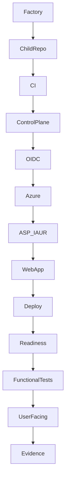

# RC83 — UI de Trazabilidad de Despliegue (Deployment Traceability)

## Objetivo

Evolucionar la landing page de los proyectos hijo Hermes para mostrar una
**Ficha de Despliegue** dinámica con un diagrama de trazabilidad que
represente visualmente toda la cadena de despliegue:

```
Factory → Child Repository → CI → Control Plane → OIDC → ASP-IAUR
→ Web App → ZIP Deploy → Readiness → Functional Tests → User-Facing
→ Evidence → ONLINE
```

## Arquitectura

La arquitectura canónica se mantiene intacta:



No se modificó:
- Control Plane (sigue siendo HERMES-ENTERPRISE)
- OIDC/FIC/RBAC
- ASP-IAUR (reutilizado, no creado)
- Arquitectura CI-only del Child

## Fuente de Datos

La UI usa una resolución en cascada para cada metadato:

1. **Entorno** — Variables `HERMES_*` inyectadas por `startup.sh`
2. **Factory** — Valores renderizados por `Crear-HermesProyecto.ps1`
3. **SQLite** — Datos almacenados durante la creación del proyecto
4. **Fallback** — `"No disponible"` si no hay dato

### Variables de Entorno

| Variable | Propósito | Origen |
|---|---|---|
| `HERMES_PROJECT_NAME` | Nombre del proyecto | Factory / startup.sh |
| `HERMES_CORRELATION_ID` | CID | Factory |
| `HERMES_WEBAPP_NAME` | Nombre del App Service | Factory |
| `HERMES_REGION` | Región Azure | `$LOCATION` / `eastus` |
| `HERMES_DEPLOYMENT_ID` | ID de despliegue | Factory / Control Plane |

### SQLite (Tabla `Proyecto`)

| Columna | Propósito |
|---|---|
| `Nombre` | Nombre del proyecto |
| `CorrelationId` | ID de correlación |
| `Estado` | Estado actual |
| `Repositorio` | URL del repositorio GitHub |
| `CommitHash` | SHA del commit desplegado |
| `Region` | Región Azure |
| `DeploymentId` | ID del despliegue |
| `EstadoAzure` | Estado de Azure |
| `EstadoCI` | Estado del CI |
| `EstadoGitHub` | Estado de GitHub |

Las columnas `Region` y `DeploymentId` se agregaron en RC83.1 mediante
ALTER TABLE en startup.sh para compatibilidad hacia atrás.

## Diagrama de Trazabilidad

El diagrama se construye en HTML/CSS puro (sin imágenes estáticas).

### Estructura

Cada nodo del pipeline contiene:

- **Icono** — Bootstrap Icon representativo
- **Nombre** — Etapa del pipeline
- **Detalle** — Información contextual (commit SHA, repositorio, resultados)
- **Estado** — Indicador visual (🟢 pass, 🔴 fail, ⏳ pending, ℹ️ info)

### Secciones

1. **ORIGEN** — Factory, Child Repository
2. **AUTOMATIZACIÓN** — CI, Control Plane
3. **SEGURIDAD** — OIDC
4. **INFRAESTRUCTURA** — ASP-IAUR, Web App
5. **DESPLIEGUE** — ZIP Deployment
6. **VALIDACIÓN** — Readiness, Functional Tests, User-Facing
7. **EVIDENCIA** — Evidence
8. **ESTADO FINAL** — ONLINE

### Datos en Tiempo Real

Cada nodo obtiene su estado de:

- **SQLite Timeline** — Eventos como "Workspace", "GitHub", "Deploy", etc.
- **SQLite SmokeTestResults** — Resultados de pruebas funcionales
- **SQLite Proyecto** — Estado de Azure, CI, GitHub

## Seguridad

La UI NO expone:

- ❌ Azure client secrets
- ❌ Tokens OIDC / GitHub PAT
- ❌ Credenciales
- ❌ Información sensible de suscripción

Sí muestra:

- ✅ Nombre del proyecto
- ✅ Repositorio GitHub
- ✅ Commit SHA (truncado a 16 chars)
- ✅ App Service (nombre público)
- ✅ Región Azure
- ✅ Runtime
- ✅ Timestamps
- ✅ URLs públicas
- ✅ Resultados de pruebas

## Pruebas

### Unitarias (nuevas en RC83.1)

- `Test-ChildTemplateRendering.ps1` — Pruebas deterministas del template:
  - Resolución de metadata
  - Identidad del proyecto (nombre, repositorio, commit)
  - Región
  - App Service
  - Nodos del pipeline
  - Ausencia de placeholders `{{...}}`

### Funcionales (existentes)

Las pruebas funcionales existentes (`Ejecutar-PruebasHumoProyecto`) continúan
verificando:
- HTTP 200 en todos los endpoints
- Contenido HTML con "HERMES ENTERPRISE"
- Tabla de pruebas funcionales
- Enlaces de acceso

## Extensibilidad

Para agregar un nuevo nodo al pipeline:

1. Agregar entrada en `_PIPELINE_DEF` (sección, id, nombre, icono)
2. Agregar estado en `_build_pipeline()` (status, detail)
3. Los nuevos proyectos mostrarán el nodo automáticamente

Para soportar un nuevo proyecto:

1. La Factory crea el proyecto con `Crear-HermesProyecto.ps1`
2. Los placeholders se renderizan con `.Replace()` (no regex)
3. startup.sh inyecta variables de entorno
4. El Control Plane despliega y la UI muestra datos reales

## Archivos Modificados

| Archivo | Cambio |
|---|---|
| `tools/Templates/backend/main.py` | Nueva landing page con diagrama de trazabilidad |
| `tools/Crear-HermesProyecto.ps1` | Reemplazo de `-replace` por `.Replace()` |
| `tools/Templates/backend/startup.sh` | Migración de DB e inyección de env vars |
| `tools/Templates/database/schema.sql` | Columnas `Region`, `DeploymentId` |
| `.github/workflows/deploy-child.yml` | Variable `VERIFIED_SHA` en evidencia |
| `tools/generate_child_evidence.py` | Uso de `verified_sha` en evidencia |

## Riesgos Pendientes

1. SQL injection en queries del template (CRITICAL-02) — mitigado en el
   template con `consultar_sqlite_param` pero el SQLite.ps1 de Factory
   aún usa interpolación de strings. Child template ya está protegido.
2. Scope `id-token: write` a nivel job — requiere separación cuidadosa.
3. Verificación de contenido en pruebas funcionales — solo HTTP status por ahora.